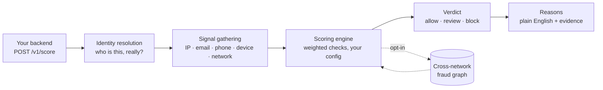

# Kaidn

### Stop fraud before it costs you money.

Fraud and abuse scoring for operators who cannot justify an enterprise fraud team.

`POST /v1/score` takes one event about a user (a signup, a login, a trial start, a cashout) and returns a score, a verdict of `allow`, `review` or `block`, and plain-English reasons. Rules make the decision. Every verdict ships with the evidence behind it.

**[kaidn.io](https://kaidn.io)** · `api.kaidn.io` · self-serve signup, transparent pricing, no sales calls

---

## The problem

If you run a rewards site, an offerwall, a marketplace, a trial, or anything that pays people money, you already know the shape of it. One person with fifty accounts. A datacenter IP wearing a residential costume. A mailbox behind twenty signups. A device that is somehow four different people.

The established fraud vendors solve this. They also want a six-figure annual commitment, a procurement cycle, and a discovery call before they will quote you. That is a rational way to sell to an institution with its own fraud department. It is a terrible fit for an operator losing four figures a month to account farming and needing an answer this week.

Kaidn is built and priced for everyone those vendors ignore. Start free, integrate in an afternoon, upgrade when the fraud you catch pays for it.

---

## Try it

```bash
curl -X POST https://api.kaidn.io/v1/score \
  -H "x-api-key: YOUR_KEY" -H "content-type: application/json" \
  -d '{"event":"cashout","user_id":"u1","ip":"3.5.140.1","email":"x@mailinator.com"}'
```

```json
{
  "score": 100,
  "verdict": "block",
  "reasons": ["abusive_asn", "datacenter_ip", "disposable_email", "abusive_email_domain"],
  "reason_text": "Strong indicators of abuse: IP is on a network with a high fraud rate in the Kaidn network; IP is a datacenter/hosting address, not a residential user; email uses a disposable/temporary domain; and email domain is on a known-abusive list. Risk score 100/100 -> block."
}
```

One call, one decision, and a sentence you can defend to the user you just stopped. Behind the response, every contributing check is itemised with its own weight and evidence, visible in your dashboard and returned to your own integration.

---

## How it works



The engine is config-driven, and the config is yours. Weights and thresholds are tunable per account, so a rewards site scoring a $2 payout and a marketplace scoring a $2,000 one do not have to share a risk appetite.

Scoring is synchronous and budgeted. Nothing in the path is allowed to become a slow signup: every enrichment is time-boxed and fails open.

---

## What it looks at

| Area | What it catches |
|---|---|
| **Network** | Datacenter and hosting ranges, proxies, VPN exits, networks with a high abuse rate |
| **Email** | Disposable and abusive domains, missing or suspicious mail infrastructure, alias and tagging tricks used to farm one mailbox into many accounts |
| **Device** | Automation and headless browsers, emulated and tampered environments, inconsistent device signals |
| **Phone** | Disposable and VoIP numbers, carrier classification |
| **Reuse** | Accounts sharing an inbox, a device or a network |
| **Velocity** | Bursts from a single origin |
| **Geography** | Stated country against observed network |
| **Network graph** | Entities already seen abusing other operators, opt-in |

Backed by intel refreshed continuously rather than shipped once:

| Dataset | Entries |
|---|---|
| Disposable email domains | 160,000+ |
| Datacenter and hosting ranges | 44,000+ |
| Disposable phone prefixes | 125,000+ |
| Proxy ranges | 12,000+ |

---

## Identity: the part most scoring APIs get wrong

A browser fingerprint is not a person. Measured on live production traffic, one raw fingerprint hash sat behind **2.31 different people** on iOS Safari. Any product that treats that hash as an identity will eventually accuse strangers of sharing an account, and it will do it most often to the users whose devices look most alike.

So Kaidn does not return a fingerprint and call it a person. It resolves an identity, and it tells you how much that identity is worth: every response carries the resolved id, how it was arrived at, and a collision risk for it. A deterministic identity and a best-effort guess are never presented as the same thing, and when there is genuinely nothing to go on, Kaidn says so instead of inventing a match.

That last part is the whole discipline. A false link between two strangers is not a smaller error than a missed fraudster; it is a worse one, because it lands on a real customer.

---

## The cross-network fraud graph

Fraud does not respect company boundaries. The same operator hits a rewards site on Monday and a marketplace on Thursday, and today neither of you finds out.

Kaidn can share abuse signals across participating operators. Entities are shared as salted hashes, never raw values, and only when the identity behind them is strong enough to be worth sharing, so a weak signal can never become a cross-operator accusation.

Opt-in, off by default, and it compounds: every operator who joins makes it sharper for the rest. Available on the Growth tier and above.

---

## Client libraries

| Package | Install | What it is |
|---|---|---|
| [`@kaidn/sdk`](https://github.com/Kaidn-io/kaidn-js) | `npm i @kaidn/sdk` | Server-side Node and TypeScript client for every keyed endpoint |
| [`@kaidn/fp`](https://github.com/Kaidn-io/kaidn-js) | `npm i @kaidn/fp` | Browser device fingerprint and signal collection, drop-in script or module |
| [`@kaidn/mcp`](https://github.com/Kaidn-io/kaidn-mcp) | `npx @kaidn/mcp` | Investigate fraud from Claude, Cursor or any MCP client |
| [`kaidn`](https://github.com/Kaidn-io/kaidn-python) | `pip install kaidn` | Official Python client, zero dependencies |
| [`caddy-ja4`](https://github.com/Kaidn-io/caddy-ja4) | Caddy module | JA4 TLS fingerprinting at the edge |

The MCP server is worth calling out. It turns an AI assistant into a fraud analyst that can explain any verdict with its evidence, pivot from one signup to every account sharing its device, IP or inbox, check an entity against the abuse network, and work the review queue. Read-only by default.

---

## Pricing

| Plan | Price | Events / month | Notable |
|---|---|---|---|
| **Free** | $0 | 10,000 | Every engine check and verdict. Kick the tyres on real traffic. |
| **Basic** | $39 | 50,000 | AI-written reasons, custom rules |
| **Starter** | $99 | 250,000 | More volume for a scaling operator |
| **Growth** | $299 | 1,000,000 | Cross-network fraud graph |
| **Enterprise** | from $999 | Custom | SLA, dedicated support |

Every plan gets the full engine. We do not hold checks back to sell you a higher tier; you are paying for volume and for the graph.

No "book a demo". Start free, upgrade when the fraud you catch pays for it.

---

## Where we are going

The goal is not to be a cheaper version of an enterprise fraud platform. It is to be the one an operator can actually adopt: self-serve, explainable, and honest about what it does and does not know.

**Explainability is the product, not a feature.** A verdict you cannot defend to the user you just blocked is worthless. Every check carries a weight, a message and its evidence, and every weight is yours to change.

**Identity is the hard part.** Most of the engineering goes into "is this the same person" rather than into stacking up more blocklists, because that is the question everything else depends on.

**The graph compounds.** Every operator who joins makes it better for the others. That is the one advantage a small vendor can build that a large one cannot simply buy.

On the roadmap: webhooks and alert signals, a URL and link scanner, transaction scoring templates, address verification, reverse identity checks, residential-proxy detection, CSV bulk import, and a 99.9% uptime SLA on Enterprise.

---

## Principles we hold ourselves to

- **A weak signal never becomes a shared key.** Inventing a link between strangers is worse than admitting we cannot tell.
- **Confidence describes, it never gates.** A confidence figure that silently changes a verdict is a second, invisible scorer with none of the visibility.
- **No scoring change ships without replaying it over real traffic first**, and reporting how many verdicts changed and in which direction.
- **Fail open, always.** A slow or broken fraud check must never become a broken signup.
- **We do not claim detections we have not measured.** Where a number comes from one operator over one month, we say so.

---

<sub>Built for operators, by an operator. Questions: [kaidn.io](https://kaidn.io)</sub>
